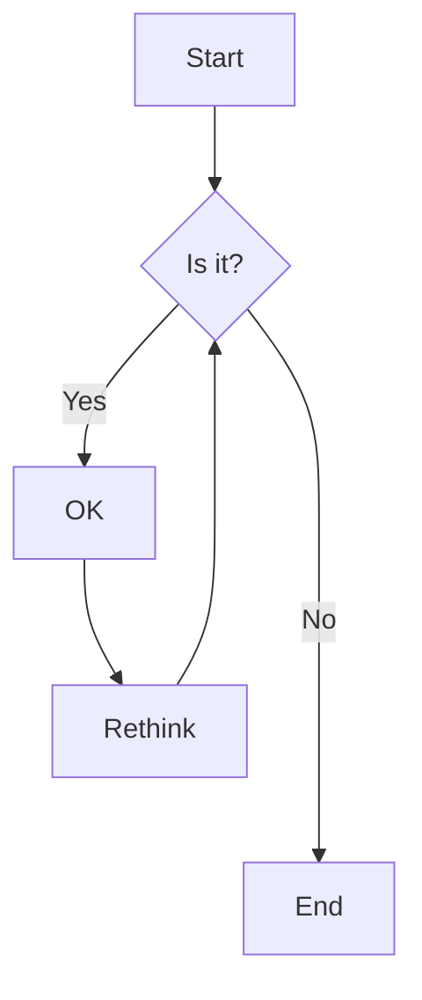
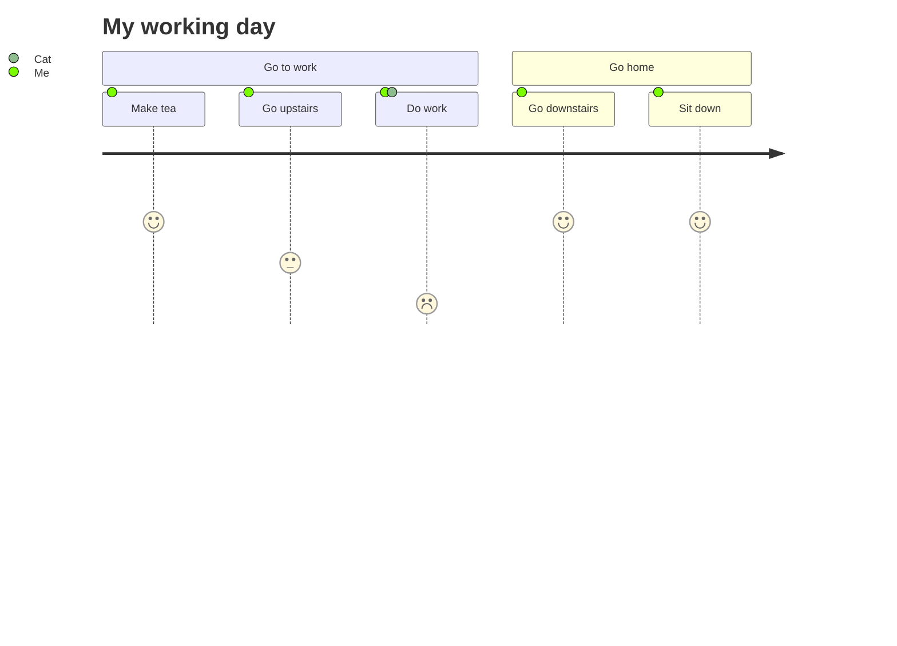

# Mermaid

Mermaid 可让您使用文本和代码创建图表和可视化效果。


具体使用可参考 [Mermaid-js](https://mermaid-js.github.io/mermaid/#/)

## 例子

### Demo1

    ```mermaid
    flowchart TD
        A[Start] --> B{Is it?};
        B -->|Yes| C[OK];
        C --> D[Rethink];
        D --> B;
        B ---->|No| E[End];
    ```



### Demo2

    ```mermaid
    journey
        title My working day
        section Go to work
        Make tea: 5: Me
        Go upstairs: 3: Me
        Do work: 1: Me, Cat
        section Go home
        Go downstairs: 5: Me
        Sit down: 5: Me
    ```



